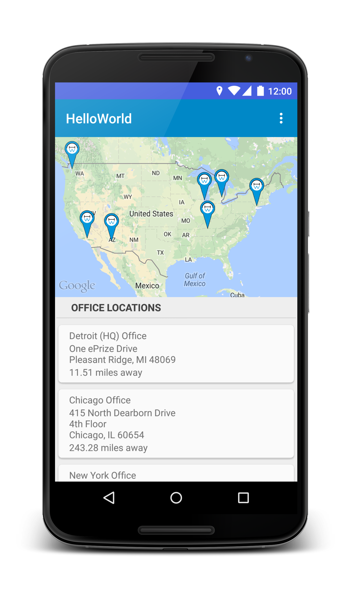
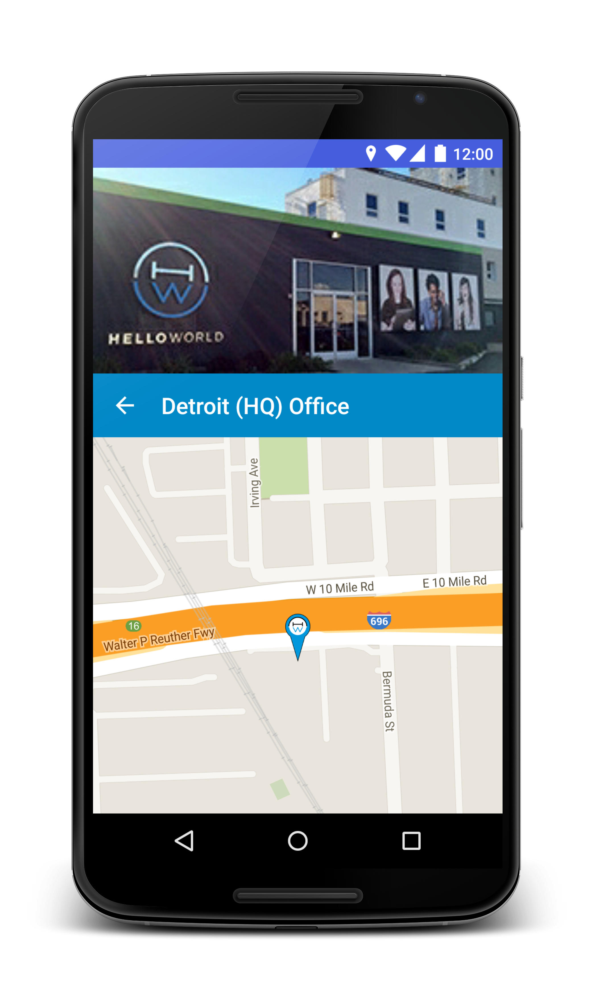
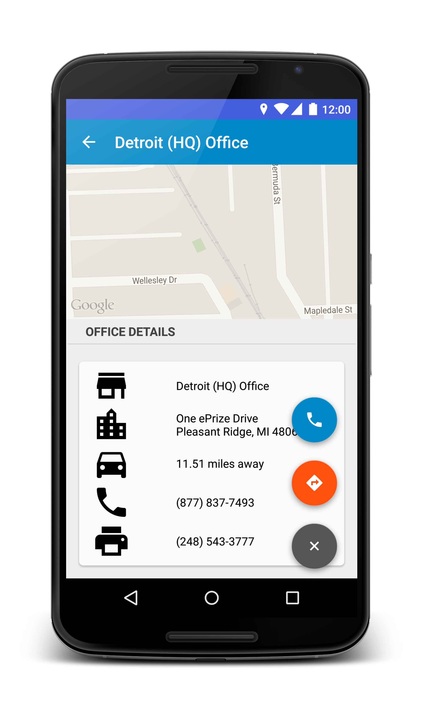

*HelloWorld App Assessment*

#### Features
* Pulls Office information from provided JSON, parses the results (while saving a [Location](https://github.com/BMc08GT/HelloWorldAssessment/blob/master/app/src/main/java/com/bmc/helloworldassessment/misc/Location.java) object for offline use), and inflates a RecyclerView, sorted by proximity if user location is detected.
* When an office is selected from list, the office details are shown in a Material Design-inspired activity, using AppCompat-v7 Toolbar, and a custom 'parallax' effect.  Also features the use of a 'FloatingActionMenu' to provide the user with the option to call or navigate to the office.

#### Screenshots

